```python
import pandas as pd

sales = pd.read_csv('sales.csv')

sales
```


<div>
<style scoped>
    .dataframe tbody tr th:only-of-type {
        vertical-align: middle;
    }

    .dataframe tbody tr th {
        vertical-align: top;
    }

    .dataframe thead th {
        text-align: right;
    }
</style>
<table border="1" class="dataframe">
  <thead>
    <tr style="text-align: right;">
      <th></th>
      <th>Invoice ID</th>
      <th>Date</th>
      <th>Time</th>
      <th>Gender</th>
      <th>Location</th>
      <th>City</th>
      <th>Member</th>
      <th>Category</th>
      <th>Price</th>
      <th>Quantity</th>
      <th>Total</th>
      <th>Payment</th>
      <th>Rating</th>
    </tr>
  </thead>
  <tbody>
    <tr>
      <th>0</th>
      <td>460489604</td>
      <td>1/25/2018</td>
      <td>16:46</td>
      <td>Male</td>
      <td>Brookfield</td>
      <td>NewYork</td>
      <td>Yes</td>
      <td>Groceries</td>
      <td>30</td>
      <td>1</td>
      <td>30</td>
      <td>Cash</td>
      <td>2</td>
    </tr>
    <tr>
      <th>1</th>
      <td>471006167</td>
      <td>3/19/2018</td>
      <td>16:48</td>
      <td>Female</td>
      <td>Water tower</td>
      <td>Chicago</td>
      <td>Yes</td>
      <td>Fashion</td>
      <td>35</td>
      <td>5</td>
      <td>175</td>
      <td>Card</td>
      <td>3</td>
    </tr>
    <tr>
      <th>2</th>
      <td>411909258</td>
      <td>2/25/2018</td>
      <td>13:33</td>
      <td>Male</td>
      <td>Water tower</td>
      <td>Chicago</td>
      <td>No</td>
      <td>Clothing</td>
      <td>57</td>
      <td>2</td>
      <td>114</td>
      <td>Cash</td>
      <td>5</td>
    </tr>
    <tr>
      <th>3</th>
      <td>487313402</td>
      <td>1/22/2018</td>
      <td>13:38</td>
      <td>Female</td>
      <td>Park lane</td>
      <td>Dallas</td>
      <td>Yes</td>
      <td>Sporting</td>
      <td>89</td>
      <td>4</td>
      <td>356</td>
      <td>Gpay</td>
      <td>1</td>
    </tr>
    <tr>
      <th>4</th>
      <td>197763430</td>
      <td>2/18/2018</td>
      <td>15:31</td>
      <td>Female</td>
      <td>Park lane</td>
      <td>Dallas</td>
      <td>No</td>
      <td>Books</td>
      <td>82</td>
      <td>5</td>
      <td>410</td>
      <td>Cash</td>
      <td>4</td>
    </tr>
    <tr>
      <th>...</th>
      <td>...</td>
      <td>...</td>
      <td>...</td>
      <td>...</td>
      <td>...</td>
      <td>...</td>
      <td>...</td>
      <td>...</td>
      <td>...</td>
      <td>...</td>
      <td>...</td>
      <td>...</td>
      <td>...</td>
    </tr>
    <tr>
      <th>995</th>
      <td>818829599</td>
      <td>3/26/2018</td>
      <td>11:19</td>
      <td>Male</td>
      <td>Park lane</td>
      <td>Dallas</td>
      <td>No</td>
      <td>Groceries</td>
      <td>31</td>
      <td>4</td>
      <td>124</td>
      <td>Card</td>
      <td>3</td>
    </tr>
    <tr>
      <th>996</th>
      <td>556589713</td>
      <td>2/20/2018</td>
      <td>17:17</td>
      <td>Male</td>
      <td>Water tower</td>
      <td>Chicago</td>
      <td>Yes</td>
      <td>Groceries</td>
      <td>3</td>
      <td>5</td>
      <td>15</td>
      <td>Gpay</td>
      <td>3</td>
    </tr>
    <tr>
      <th>997</th>
      <td>82324424</td>
      <td>2/6/2018</td>
      <td>11:44</td>
      <td>Male</td>
      <td>Brookfield</td>
      <td>NewYork</td>
      <td>No</td>
      <td>Clothing</td>
      <td>71</td>
      <td>5</td>
      <td>355</td>
      <td>Card</td>
      <td>3</td>
    </tr>
    <tr>
      <th>998</th>
      <td>783661702</td>
      <td>1/29/2018</td>
      <td>15:44</td>
      <td>Female</td>
      <td>Brookfield</td>
      <td>NewYork</td>
      <td>No</td>
      <td>Clothing</td>
      <td>89</td>
      <td>7</td>
      <td>623</td>
      <td>Cash</td>
      <td>5</td>
    </tr>
    <tr>
      <th>999</th>
      <td>759171975</td>
      <td>1/31/2018</td>
      <td>10:13</td>
      <td>Female</td>
      <td>Water tower</td>
      <td>Chicago</td>
      <td>Yes</td>
      <td>Clothing</td>
      <td>31</td>
      <td>7</td>
      <td>217</td>
      <td>Gpay</td>
      <td>3</td>
    </tr>
  </tbody>
</table>
<p>1000 rows × 13 columns</p>
</div>


```python
# show first 10 rows
sales.head(10)
```


<div>
<style scoped>
    .dataframe tbody tr th:only-of-type {
        vertical-align: middle;
    }

    .dataframe tbody tr th {
        vertical-align: top;
    }

    .dataframe thead th {
        text-align: right;
    }
</style>
<table border="1" class="dataframe">
  <thead>
    <tr style="text-align: right;">
      <th></th>
      <th>Invoice ID</th>
      <th>Date</th>
      <th>Time</th>
      <th>Gender</th>
      <th>Location</th>
      <th>City</th>
      <th>Member</th>
      <th>Category</th>
      <th>Price</th>
      <th>Quantity</th>
      <th>Total</th>
      <th>Payment</th>
      <th>Rating</th>
    </tr>
  </thead>
  <tbody>
    <tr>
      <th>0</th>
      <td>460489604</td>
      <td>1/25/2018</td>
      <td>16:46</td>
      <td>Male</td>
      <td>Brookfield</td>
      <td>NewYork</td>
      <td>Yes</td>
      <td>Groceries</td>
      <td>30</td>
      <td>1</td>
      <td>30</td>
      <td>Cash</td>
      <td>2</td>
    </tr>
    <tr>
      <th>1</th>
      <td>471006167</td>
      <td>3/19/2018</td>
      <td>16:48</td>
      <td>Female</td>
      <td>Water tower</td>
      <td>Chicago</td>
      <td>Yes</td>
      <td>Fashion</td>
      <td>35</td>
      <td>5</td>
      <td>175</td>
      <td>Card</td>
      <td>3</td>
    </tr>
    <tr>
      <th>2</th>
      <td>411909258</td>
      <td>2/25/2018</td>
      <td>13:33</td>
      <td>Male</td>
      <td>Water tower</td>
      <td>Chicago</td>
      <td>No</td>
      <td>Clothing</td>
      <td>57</td>
      <td>2</td>
      <td>114</td>
      <td>Cash</td>
      <td>5</td>
    </tr>
    <tr>
      <th>3</th>
      <td>487313402</td>
      <td>1/22/2018</td>
      <td>13:38</td>
      <td>Female</td>
      <td>Park lane</td>
      <td>Dallas</td>
      <td>Yes</td>
      <td>Sporting</td>
      <td>89</td>
      <td>4</td>
      <td>356</td>
      <td>Gpay</td>
      <td>1</td>
    </tr>
    <tr>
      <th>4</th>
      <td>197763430</td>
      <td>2/18/2018</td>
      <td>15:31</td>
      <td>Female</td>
      <td>Park lane</td>
      <td>Dallas</td>
      <td>No</td>
      <td>Books</td>
      <td>82</td>
      <td>5</td>
      <td>410</td>
      <td>Cash</td>
      <td>4</td>
    </tr>
    <tr>
      <th>5</th>
      <td>263634050</td>
      <td>3/9/2018</td>
      <td>17:55</td>
      <td>Male</td>
      <td>Brookfield</td>
      <td>NewYork</td>
      <td>Yes</td>
      <td>Clothing</td>
      <td>52</td>
      <td>4</td>
      <td>208</td>
      <td>Gpay</td>
      <td>3</td>
    </tr>
    <tr>
      <th>6</th>
      <td>99646662</td>
      <td>3/4/2018</td>
      <td>13:21</td>
      <td>Male</td>
      <td>Water tower</td>
      <td>Chicago</td>
      <td>No</td>
      <td>Clothing</td>
      <td>81</td>
      <td>3</td>
      <td>243</td>
      <td>Cash</td>
      <td>4</td>
    </tr>
    <tr>
      <th>7</th>
      <td>188869875</td>
      <td>3/8/2018</td>
      <td>13:24</td>
      <td>Male</td>
      <td>Park lane</td>
      <td>Dallas</td>
      <td>No</td>
      <td>Books</td>
      <td>80</td>
      <td>2</td>
      <td>160</td>
      <td>Cash</td>
      <td>3</td>
    </tr>
    <tr>
      <th>8</th>
      <td>325637547</td>
      <td>1/18/2018</td>
      <td>15:33</td>
      <td>Male</td>
      <td>Park lane</td>
      <td>Dallas</td>
      <td>Yes</td>
      <td>Clothing</td>
      <td>91</td>
      <td>3</td>
      <td>273</td>
      <td>Card</td>
      <td>3</td>
    </tr>
    <tr>
      <th>9</th>
      <td>562942936</td>
      <td>2/24/2018</td>
      <td>16:05</td>
      <td>Female</td>
      <td>Park lane</td>
      <td>Dallas</td>
      <td>No</td>
      <td>Books</td>
      <td>80</td>
      <td>2</td>
      <td>160</td>
      <td>Cash</td>
      <td>4</td>
    </tr>
  </tbody>
</table>
</div>


```python
# show selected coloumn

sales['Invoice ID'].head(5)
```


    0    460489604
    1    471006167
    2    411909258
    3    487313402
    4    197763430
    Name: Invoice ID, dtype: int64


```python
# show unique category types

sales['Category'].unique()
```


    array(['Groceries', 'Fashion', 'Clothing', 'Sporting', 'Books',
           'Furniture'], dtype=object)


```python
# selected index details

sales.iloc[200]
```


    Invoice ID      576523018
    Date            2/15/2018
    Time                12:35
    Gender               Male
    Location      Water tower
    City              Chicago
    Member                 No
    Category        Groceries
    Price                  82
    Quantity                1
    Total                  82
    Payment              Card
    Rating                  4
    Name: 200, dtype: object


```python
# slicing: get detail from a range to next range

sales[200:210]
```


<div>
<style scoped>
    .dataframe tbody tr th:only-of-type {
        vertical-align: middle;
    }

    .dataframe tbody tr th {
        vertical-align: top;
    }

    .dataframe thead th {
        text-align: right;
    }
</style>
<table border="1" class="dataframe">
  <thead>
    <tr style="text-align: right;">
      <th></th>
      <th>Invoice ID</th>
      <th>Date</th>
      <th>Time</th>
      <th>Gender</th>
      <th>Location</th>
      <th>City</th>
      <th>Member</th>
      <th>Category</th>
      <th>Price</th>
      <th>Quantity</th>
      <th>Total</th>
      <th>Payment</th>
      <th>Rating</th>
    </tr>
  </thead>
  <tbody>
    <tr>
      <th>200</th>
      <td>576523018</td>
      <td>2/15/2018</td>
      <td>12:35</td>
      <td>Male</td>
      <td>Water tower</td>
      <td>Chicago</td>
      <td>No</td>
      <td>Groceries</td>
      <td>82</td>
      <td>1</td>
      <td>82</td>
      <td>Card</td>
      <td>4</td>
    </tr>
    <tr>
      <th>201</th>
      <td>414119922</td>
      <td>1/30/2018</td>
      <td>11:07</td>
      <td>Male</td>
      <td>Water tower</td>
      <td>Chicago</td>
      <td>No</td>
      <td>Sporting</td>
      <td>44</td>
      <td>7</td>
      <td>308</td>
      <td>Card</td>
      <td>3</td>
    </tr>
    <tr>
      <th>202</th>
      <td>123247697</td>
      <td>2/8/2018</td>
      <td>20:03</td>
      <td>Male</td>
      <td>Brookfield</td>
      <td>NewYork</td>
      <td>No</td>
      <td>Groceries</td>
      <td>22</td>
      <td>7</td>
      <td>154</td>
      <td>Card</td>
      <td>5</td>
    </tr>
    <tr>
      <th>203</th>
      <td>40419058</td>
      <td>1/26/2018</td>
      <td>14:53</td>
      <td>Male</td>
      <td>Water tower</td>
      <td>Chicago</td>
      <td>Yes</td>
      <td>Books</td>
      <td>95</td>
      <td>6</td>
      <td>570</td>
      <td>Card</td>
      <td>1</td>
    </tr>
    <tr>
      <th>204</th>
      <td>890497298</td>
      <td>2/25/2018</td>
      <td>18:06</td>
      <td>Female</td>
      <td>Water tower</td>
      <td>Chicago</td>
      <td>No</td>
      <td>Clothing</td>
      <td>69</td>
      <td>2</td>
      <td>138</td>
      <td>Cash</td>
      <td>2</td>
    </tr>
    <tr>
      <th>205</th>
      <td>885702268</td>
      <td>1/28/2018</td>
      <td>12:45</td>
      <td>Male</td>
      <td>Brookfield</td>
      <td>NewYork</td>
      <td>No</td>
      <td>Groceries</td>
      <td>89</td>
      <td>6</td>
      <td>534</td>
      <td>Card</td>
      <td>1</td>
    </tr>
    <tr>
      <th>206</th>
      <td>172252194</td>
      <td>3/22/2018</td>
      <td>20:10</td>
      <td>Female</td>
      <td>Park lane</td>
      <td>Dallas</td>
      <td>No</td>
      <td>Books</td>
      <td>41</td>
      <td>6</td>
      <td>246</td>
      <td>Card</td>
      <td>4</td>
    </tr>
    <tr>
      <th>207</th>
      <td>866140211</td>
      <td>2/25/2018</td>
      <td>13:34</td>
      <td>Female</td>
      <td>Park lane</td>
      <td>Dallas</td>
      <td>No</td>
      <td>Clothing</td>
      <td>54</td>
      <td>6</td>
      <td>324</td>
      <td>Gpay</td>
      <td>4</td>
    </tr>
    <tr>
      <th>208</th>
      <td>597678548</td>
      <td>3/15/2018</td>
      <td>17:35</td>
      <td>Male</td>
      <td>Water tower</td>
      <td>Chicago</td>
      <td>Yes</td>
      <td>Sporting</td>
      <td>34</td>
      <td>3</td>
      <td>102</td>
      <td>Cash</td>
      <td>1</td>
    </tr>
    <tr>
      <th>209</th>
      <td>428818456</td>
      <td>2/25/2018</td>
      <td>18:50</td>
      <td>Male</td>
      <td>Park lane</td>
      <td>Dallas</td>
      <td>Yes</td>
      <td>Books</td>
      <td>94</td>
      <td>5</td>
      <td>470</td>
      <td>Cash</td>
      <td>2</td>
    </tr>
  </tbody>
</table>
</div>


```python
# last 5 datasets

sales.tail()
```


<div>
<style scoped>
    .dataframe tbody tr th:only-of-type {
        vertical-align: middle;
    }

    .dataframe tbody tr th {
        vertical-align: top;
    }

    .dataframe thead th {
        text-align: right;
    }
</style>
<table border="1" class="dataframe">
  <thead>
    <tr style="text-align: right;">
      <th></th>
      <th>Invoice ID</th>
      <th>Date</th>
      <th>Time</th>
      <th>Gender</th>
      <th>Location</th>
      <th>City</th>
      <th>Member</th>
      <th>Category</th>
      <th>Price</th>
      <th>Quantity</th>
      <th>Total</th>
      <th>Payment</th>
      <th>Rating</th>
    </tr>
  </thead>
  <tbody>
    <tr>
      <th>995</th>
      <td>818829599</td>
      <td>3/26/2018</td>
      <td>11:19</td>
      <td>Male</td>
      <td>Park lane</td>
      <td>Dallas</td>
      <td>No</td>
      <td>Groceries</td>
      <td>31</td>
      <td>4</td>
      <td>124</td>
      <td>Card</td>
      <td>3</td>
    </tr>
    <tr>
      <th>996</th>
      <td>556589713</td>
      <td>2/20/2018</td>
      <td>17:17</td>
      <td>Male</td>
      <td>Water tower</td>
      <td>Chicago</td>
      <td>Yes</td>
      <td>Groceries</td>
      <td>3</td>
      <td>5</td>
      <td>15</td>
      <td>Gpay</td>
      <td>3</td>
    </tr>
    <tr>
      <th>997</th>
      <td>82324424</td>
      <td>2/6/2018</td>
      <td>11:44</td>
      <td>Male</td>
      <td>Brookfield</td>
      <td>NewYork</td>
      <td>No</td>
      <td>Clothing</td>
      <td>71</td>
      <td>5</td>
      <td>355</td>
      <td>Card</td>
      <td>3</td>
    </tr>
    <tr>
      <th>998</th>
      <td>783661702</td>
      <td>1/29/2018</td>
      <td>15:44</td>
      <td>Female</td>
      <td>Brookfield</td>
      <td>NewYork</td>
      <td>No</td>
      <td>Clothing</td>
      <td>89</td>
      <td>7</td>
      <td>623</td>
      <td>Cash</td>
      <td>5</td>
    </tr>
    <tr>
      <th>999</th>
      <td>759171975</td>
      <td>1/31/2018</td>
      <td>10:13</td>
      <td>Female</td>
      <td>Water tower</td>
      <td>Chicago</td>
      <td>Yes</td>
      <td>Clothing</td>
      <td>31</td>
      <td>7</td>
      <td>217</td>
      <td>Gpay</td>
      <td>3</td>
    </tr>
  </tbody>
</table>
</div>


```python
# last 10 rows

sales.tail(10)
```


<div>
<style scoped>
    .dataframe tbody tr th:only-of-type {
        vertical-align: middle;
    }

    .dataframe tbody tr th {
        vertical-align: top;
    }

    .dataframe thead th {
        text-align: right;
    }
</style>
<table border="1" class="dataframe">
  <thead>
    <tr style="text-align: right;">
      <th></th>
      <th>Invoice ID</th>
      <th>Date</th>
      <th>Time</th>
      <th>Gender</th>
      <th>Location</th>
      <th>City</th>
      <th>Member</th>
      <th>Category</th>
      <th>Price</th>
      <th>Quantity</th>
      <th>Total</th>
      <th>Payment</th>
      <th>Rating</th>
    </tr>
  </thead>
  <tbody>
    <tr>
      <th>990</th>
      <td>752407865</td>
      <td>1/15/2018</td>
      <td>10:01</td>
      <td>Male</td>
      <td>Water tower</td>
      <td>Chicago</td>
      <td>Yes</td>
      <td>Clothing</td>
      <td>25</td>
      <td>4</td>
      <td>100</td>
      <td>Cash</td>
      <td>5</td>
    </tr>
    <tr>
      <th>991</th>
      <td>699906043</td>
      <td>2/15/2018</td>
      <td>12:58</td>
      <td>Male</td>
      <td>Brookfield</td>
      <td>NewYork</td>
      <td>Yes</td>
      <td>Furniture</td>
      <td>96</td>
      <td>7</td>
      <td>672</td>
      <td>Card</td>
      <td>3</td>
    </tr>
    <tr>
      <th>992</th>
      <td>927909627</td>
      <td>3/2/2018</td>
      <td>13:35</td>
      <td>Male</td>
      <td>Brookfield</td>
      <td>NewYork</td>
      <td>No</td>
      <td>Books</td>
      <td>54</td>
      <td>1</td>
      <td>54</td>
      <td>Card</td>
      <td>1</td>
    </tr>
    <tr>
      <th>993</th>
      <td>455112063</td>
      <td>3/19/2018</td>
      <td>17:30</td>
      <td>Female</td>
      <td>Brookfield</td>
      <td>NewYork</td>
      <td>Yes</td>
      <td>Clothing</td>
      <td>3</td>
      <td>3</td>
      <td>9</td>
      <td>Cash</td>
      <td>2</td>
    </tr>
    <tr>
      <th>994</th>
      <td>446582560</td>
      <td>1/31/2018</td>
      <td>19:00</td>
      <td>Male</td>
      <td>Water tower</td>
      <td>Chicago</td>
      <td>No</td>
      <td>Fashion</td>
      <td>29</td>
      <td>5</td>
      <td>145</td>
      <td>Cash</td>
      <td>4</td>
    </tr>
    <tr>
      <th>995</th>
      <td>818829599</td>
      <td>3/26/2018</td>
      <td>11:19</td>
      <td>Male</td>
      <td>Park lane</td>
      <td>Dallas</td>
      <td>No</td>
      <td>Groceries</td>
      <td>31</td>
      <td>4</td>
      <td>124</td>
      <td>Card</td>
      <td>3</td>
    </tr>
    <tr>
      <th>996</th>
      <td>556589713</td>
      <td>2/20/2018</td>
      <td>17:17</td>
      <td>Male</td>
      <td>Water tower</td>
      <td>Chicago</td>
      <td>Yes</td>
      <td>Groceries</td>
      <td>3</td>
      <td>5</td>
      <td>15</td>
      <td>Gpay</td>
      <td>3</td>
    </tr>
    <tr>
      <th>997</th>
      <td>82324424</td>
      <td>2/6/2018</td>
      <td>11:44</td>
      <td>Male</td>
      <td>Brookfield</td>
      <td>NewYork</td>
      <td>No</td>
      <td>Clothing</td>
      <td>71</td>
      <td>5</td>
      <td>355</td>
      <td>Card</td>
      <td>3</td>
    </tr>
    <tr>
      <th>998</th>
      <td>783661702</td>
      <td>1/29/2018</td>
      <td>15:44</td>
      <td>Female</td>
      <td>Brookfield</td>
      <td>NewYork</td>
      <td>No</td>
      <td>Clothing</td>
      <td>89</td>
      <td>7</td>
      <td>623</td>
      <td>Cash</td>
      <td>5</td>
    </tr>
    <tr>
      <th>999</th>
      <td>759171975</td>
      <td>1/31/2018</td>
      <td>10:13</td>
      <td>Female</td>
      <td>Water tower</td>
      <td>Chicago</td>
      <td>Yes</td>
      <td>Clothing</td>
      <td>31</td>
      <td>7</td>
      <td>217</td>
      <td>Gpay</td>
      <td>3</td>
    </tr>
  </tbody>
</table>
</div>


```python
# view gender == male

sales[sales['Gender'] == 'Male']
```


<div>
<style scoped>
    .dataframe tbody tr th:only-of-type {
        vertical-align: middle;
    }

    .dataframe tbody tr th {
        vertical-align: top;
    }

    .dataframe thead th {
        text-align: right;
    }
</style>
<table border="1" class="dataframe">
  <thead>
    <tr style="text-align: right;">
      <th></th>
      <th>Invoice ID</th>
      <th>Date</th>
      <th>Time</th>
      <th>Gender</th>
      <th>Location</th>
      <th>City</th>
      <th>Member</th>
      <th>Category</th>
      <th>Price</th>
      <th>Quantity</th>
      <th>Total</th>
      <th>Payment</th>
      <th>Rating</th>
    </tr>
  </thead>
  <tbody>
    <tr>
      <th>0</th>
      <td>460489604</td>
      <td>1/25/2018</td>
      <td>16:46</td>
      <td>Male</td>
      <td>Brookfield</td>
      <td>NewYork</td>
      <td>Yes</td>
      <td>Groceries</td>
      <td>30</td>
      <td>1</td>
      <td>30</td>
      <td>Cash</td>
      <td>2</td>
    </tr>
    <tr>
      <th>2</th>
      <td>411909258</td>
      <td>2/25/2018</td>
      <td>13:33</td>
      <td>Male</td>
      <td>Water tower</td>
      <td>Chicago</td>
      <td>No</td>
      <td>Clothing</td>
      <td>57</td>
      <td>2</td>
      <td>114</td>
      <td>Cash</td>
      <td>5</td>
    </tr>
    <tr>
      <th>5</th>
      <td>263634050</td>
      <td>3/9/2018</td>
      <td>17:55</td>
      <td>Male</td>
      <td>Brookfield</td>
      <td>NewYork</td>
      <td>Yes</td>
      <td>Clothing</td>
      <td>52</td>
      <td>4</td>
      <td>208</td>
      <td>Gpay</td>
      <td>3</td>
    </tr>
    <tr>
      <th>6</th>
      <td>99646662</td>
      <td>3/4/2018</td>
      <td>13:21</td>
      <td>Male</td>
      <td>Water tower</td>
      <td>Chicago</td>
      <td>No</td>
      <td>Clothing</td>
      <td>81</td>
      <td>3</td>
      <td>243</td>
      <td>Cash</td>
      <td>4</td>
    </tr>
    <tr>
      <th>7</th>
      <td>188869875</td>
      <td>3/8/2018</td>
      <td>13:24</td>
      <td>Male</td>
      <td>Park lane</td>
      <td>Dallas</td>
      <td>No</td>
      <td>Books</td>
      <td>80</td>
      <td>2</td>
      <td>160</td>
      <td>Cash</td>
      <td>3</td>
    </tr>
    <tr>
      <th>...</th>
      <td>...</td>
      <td>...</td>
      <td>...</td>
      <td>...</td>
      <td>...</td>
      <td>...</td>
      <td>...</td>
      <td>...</td>
      <td>...</td>
      <td>...</td>
      <td>...</td>
      <td>...</td>
      <td>...</td>
    </tr>
    <tr>
      <th>992</th>
      <td>927909627</td>
      <td>3/2/2018</td>
      <td>13:35</td>
      <td>Male</td>
      <td>Brookfield</td>
      <td>NewYork</td>
      <td>No</td>
      <td>Books</td>
      <td>54</td>
      <td>1</td>
      <td>54</td>
      <td>Card</td>
      <td>1</td>
    </tr>
    <tr>
      <th>994</th>
      <td>446582560</td>
      <td>1/31/2018</td>
      <td>19:00</td>
      <td>Male</td>
      <td>Water tower</td>
      <td>Chicago</td>
      <td>No</td>
      <td>Fashion</td>
      <td>29</td>
      <td>5</td>
      <td>145</td>
      <td>Cash</td>
      <td>4</td>
    </tr>
    <tr>
      <th>995</th>
      <td>818829599</td>
      <td>3/26/2018</td>
      <td>11:19</td>
      <td>Male</td>
      <td>Park lane</td>
      <td>Dallas</td>
      <td>No</td>
      <td>Groceries</td>
      <td>31</td>
      <td>4</td>
      <td>124</td>
      <td>Card</td>
      <td>3</td>
    </tr>
    <tr>
      <th>996</th>
      <td>556589713</td>
      <td>2/20/2018</td>
      <td>17:17</td>
      <td>Male</td>
      <td>Water tower</td>
      <td>Chicago</td>
      <td>Yes</td>
      <td>Groceries</td>
      <td>3</td>
      <td>5</td>
      <td>15</td>
      <td>Gpay</td>
      <td>3</td>
    </tr>
    <tr>
      <th>997</th>
      <td>82324424</td>
      <td>2/6/2018</td>
      <td>11:44</td>
      <td>Male</td>
      <td>Brookfield</td>
      <td>NewYork</td>
      <td>No</td>
      <td>Clothing</td>
      <td>71</td>
      <td>5</td>
      <td>355</td>
      <td>Card</td>
      <td>3</td>
    </tr>
  </tbody>
</table>
<p>499 rows × 13 columns</p>
</div>


```python
# view gender == female from first 10

sales[sales['Gender'] == 'Female'].head(10)
```


<div>
<style scoped>
    .dataframe tbody tr th:only-of-type {
        vertical-align: middle;
    }

    .dataframe tbody tr th {
        vertical-align: top;
    }

    .dataframe thead th {
        text-align: right;
    }
</style>
<table border="1" class="dataframe">
  <thead>
    <tr style="text-align: right;">
      <th></th>
      <th>Invoice ID</th>
      <th>Date</th>
      <th>Time</th>
      <th>Gender</th>
      <th>Location</th>
      <th>City</th>
      <th>Member</th>
      <th>Category</th>
      <th>Price</th>
      <th>Quantity</th>
      <th>Total</th>
      <th>Payment</th>
      <th>Rating</th>
    </tr>
  </thead>
  <tbody>
    <tr>
      <th>1</th>
      <td>471006167</td>
      <td>3/19/2018</td>
      <td>16:48</td>
      <td>Female</td>
      <td>Water tower</td>
      <td>Chicago</td>
      <td>Yes</td>
      <td>Fashion</td>
      <td>35</td>
      <td>5</td>
      <td>175</td>
      <td>Card</td>
      <td>3</td>
    </tr>
    <tr>
      <th>3</th>
      <td>487313402</td>
      <td>1/22/2018</td>
      <td>13:38</td>
      <td>Female</td>
      <td>Park lane</td>
      <td>Dallas</td>
      <td>Yes</td>
      <td>Sporting</td>
      <td>89</td>
      <td>4</td>
      <td>356</td>
      <td>Gpay</td>
      <td>1</td>
    </tr>
    <tr>
      <th>4</th>
      <td>197763430</td>
      <td>2/18/2018</td>
      <td>15:31</td>
      <td>Female</td>
      <td>Park lane</td>
      <td>Dallas</td>
      <td>No</td>
      <td>Books</td>
      <td>82</td>
      <td>5</td>
      <td>410</td>
      <td>Cash</td>
      <td>4</td>
    </tr>
    <tr>
      <th>9</th>
      <td>562942936</td>
      <td>2/24/2018</td>
      <td>16:05</td>
      <td>Female</td>
      <td>Park lane</td>
      <td>Dallas</td>
      <td>No</td>
      <td>Books</td>
      <td>80</td>
      <td>2</td>
      <td>160</td>
      <td>Cash</td>
      <td>4</td>
    </tr>
    <tr>
      <th>10</th>
      <td>388412668</td>
      <td>2/26/2018</td>
      <td>11:32</td>
      <td>Female</td>
      <td>Brookfield</td>
      <td>NewYork</td>
      <td>No</td>
      <td>Furniture</td>
      <td>35</td>
      <td>4</td>
      <td>140</td>
      <td>Gpay</td>
      <td>4</td>
    </tr>
    <tr>
      <th>13</th>
      <td>942406749</td>
      <td>1/18/2018</td>
      <td>15:20</td>
      <td>Female</td>
      <td>Water tower</td>
      <td>Chicago</td>
      <td>Yes</td>
      <td>Clothing</td>
      <td>9</td>
      <td>6</td>
      <td>54</td>
      <td>Gpay</td>
      <td>5</td>
    </tr>
    <tr>
      <th>14</th>
      <td>547572603</td>
      <td>3/21/2018</td>
      <td>13:23</td>
      <td>Female</td>
      <td>Brookfield</td>
      <td>NewYork</td>
      <td>No</td>
      <td>Fashion</td>
      <td>98</td>
      <td>7</td>
      <td>686</td>
      <td>Gpay</td>
      <td>3</td>
    </tr>
    <tr>
      <th>15</th>
      <td>355981315</td>
      <td>2/15/2018</td>
      <td>15:47</td>
      <td>Female</td>
      <td>Brookfield</td>
      <td>NewYork</td>
      <td>Yes</td>
      <td>Clothing</td>
      <td>78</td>
      <td>5</td>
      <td>390</td>
      <td>Card</td>
      <td>5</td>
    </tr>
    <tr>
      <th>16</th>
      <td>397754805</td>
      <td>2/9/2018</td>
      <td>15:59</td>
      <td>Female</td>
      <td>Brookfield</td>
      <td>NewYork</td>
      <td>Yes</td>
      <td>Sporting</td>
      <td>35</td>
      <td>7</td>
      <td>245</td>
      <td>Gpay</td>
      <td>1</td>
    </tr>
    <tr>
      <th>18</th>
      <td>542144906</td>
      <td>2/6/2018</td>
      <td>10:58</td>
      <td>Female</td>
      <td>Brookfield</td>
      <td>NewYork</td>
      <td>Yes</td>
      <td>Fashion</td>
      <td>33</td>
      <td>5</td>
      <td>165</td>
      <td>Gpay</td>
      <td>2</td>
    </tr>
  </tbody>
</table>
</div>


```python
# total > 200

sales[sales['Total'] > 200]
```


<div>
<style scoped>
    .dataframe tbody tr th:only-of-type {
        vertical-align: middle;
    }

    .dataframe tbody tr th {
        vertical-align: top;
    }

    .dataframe thead th {
        text-align: right;
    }
</style>
<table border="1" class="dataframe">
  <thead>
    <tr style="text-align: right;">
      <th></th>
      <th>Invoice ID</th>
      <th>Date</th>
      <th>Time</th>
      <th>Gender</th>
      <th>Location</th>
      <th>City</th>
      <th>Member</th>
      <th>Category</th>
      <th>Price</th>
      <th>Quantity</th>
      <th>Total</th>
      <th>Payment</th>
      <th>Rating</th>
    </tr>
  </thead>
  <tbody>
    <tr>
      <th>3</th>
      <td>487313402</td>
      <td>1/22/2018</td>
      <td>13:38</td>
      <td>Female</td>
      <td>Park lane</td>
      <td>Dallas</td>
      <td>Yes</td>
      <td>Sporting</td>
      <td>89</td>
      <td>4</td>
      <td>356</td>
      <td>Gpay</td>
      <td>1</td>
    </tr>
    <tr>
      <th>4</th>
      <td>197763430</td>
      <td>2/18/2018</td>
      <td>15:31</td>
      <td>Female</td>
      <td>Park lane</td>
      <td>Dallas</td>
      <td>No</td>
      <td>Books</td>
      <td>82</td>
      <td>5</td>
      <td>410</td>
      <td>Cash</td>
      <td>4</td>
    </tr>
    <tr>
      <th>5</th>
      <td>263634050</td>
      <td>3/9/2018</td>
      <td>17:55</td>
      <td>Male</td>
      <td>Brookfield</td>
      <td>NewYork</td>
      <td>Yes</td>
      <td>Clothing</td>
      <td>52</td>
      <td>4</td>
      <td>208</td>
      <td>Gpay</td>
      <td>3</td>
    </tr>
    <tr>
      <th>6</th>
      <td>99646662</td>
      <td>3/4/2018</td>
      <td>13:21</td>
      <td>Male</td>
      <td>Water tower</td>
      <td>Chicago</td>
      <td>No</td>
      <td>Clothing</td>
      <td>81</td>
      <td>3</td>
      <td>243</td>
      <td>Cash</td>
      <td>4</td>
    </tr>
    <tr>
      <th>8</th>
      <td>325637547</td>
      <td>1/18/2018</td>
      <td>15:33</td>
      <td>Male</td>
      <td>Park lane</td>
      <td>Dallas</td>
      <td>Yes</td>
      <td>Clothing</td>
      <td>91</td>
      <td>3</td>
      <td>273</td>
      <td>Card</td>
      <td>3</td>
    </tr>
    <tr>
      <th>...</th>
      <td>...</td>
      <td>...</td>
      <td>...</td>
      <td>...</td>
      <td>...</td>
      <td>...</td>
      <td>...</td>
      <td>...</td>
      <td>...</td>
      <td>...</td>
      <td>...</td>
      <td>...</td>
      <td>...</td>
    </tr>
    <tr>
      <th>987</th>
      <td>245049016</td>
      <td>1/20/2018</td>
      <td>10:03</td>
      <td>Female</td>
      <td>Park lane</td>
      <td>Dallas</td>
      <td>No</td>
      <td>Furniture</td>
      <td>74</td>
      <td>4</td>
      <td>296</td>
      <td>Card</td>
      <td>4</td>
    </tr>
    <tr>
      <th>991</th>
      <td>699906043</td>
      <td>2/15/2018</td>
      <td>12:58</td>
      <td>Male</td>
      <td>Brookfield</td>
      <td>NewYork</td>
      <td>Yes</td>
      <td>Furniture</td>
      <td>96</td>
      <td>7</td>
      <td>672</td>
      <td>Card</td>
      <td>3</td>
    </tr>
    <tr>
      <th>997</th>
      <td>82324424</td>
      <td>2/6/2018</td>
      <td>11:44</td>
      <td>Male</td>
      <td>Brookfield</td>
      <td>NewYork</td>
      <td>No</td>
      <td>Clothing</td>
      <td>71</td>
      <td>5</td>
      <td>355</td>
      <td>Card</td>
      <td>3</td>
    </tr>
    <tr>
      <th>998</th>
      <td>783661702</td>
      <td>1/29/2018</td>
      <td>15:44</td>
      <td>Female</td>
      <td>Brookfield</td>
      <td>NewYork</td>
      <td>No</td>
      <td>Clothing</td>
      <td>89</td>
      <td>7</td>
      <td>623</td>
      <td>Cash</td>
      <td>5</td>
    </tr>
    <tr>
      <th>999</th>
      <td>759171975</td>
      <td>1/31/2018</td>
      <td>10:13</td>
      <td>Female</td>
      <td>Water tower</td>
      <td>Chicago</td>
      <td>Yes</td>
      <td>Clothing</td>
      <td>31</td>
      <td>7</td>
      <td>217</td>
      <td>Gpay</td>
      <td>3</td>
    </tr>
  </tbody>
</table>
<p>419 rows × 13 columns</p>
</div>


```python
# total < 50 from last 5 rows

sales[sales['Total'] < 50].tail(5)
```


<div>
<style scoped>
    .dataframe tbody tr th:only-of-type {
        vertical-align: middle;
    }

    .dataframe tbody tr th {
        vertical-align: top;
    }

    .dataframe thead th {
        text-align: right;
    }
</style>
<table border="1" class="dataframe">
  <thead>
    <tr style="text-align: right;">
      <th></th>
      <th>Invoice ID</th>
      <th>Date</th>
      <th>Time</th>
      <th>Gender</th>
      <th>Location</th>
      <th>City</th>
      <th>Member</th>
      <th>Category</th>
      <th>Price</th>
      <th>Quantity</th>
      <th>Total</th>
      <th>Payment</th>
      <th>Rating</th>
    </tr>
  </thead>
  <tbody>
    <tr>
      <th>976</th>
      <td>497734676</td>
      <td>2/9/2018</td>
      <td>14:14</td>
      <td>Male</td>
      <td>Park lane</td>
      <td>Dallas</td>
      <td>No</td>
      <td>Sporting</td>
      <td>5</td>
      <td>4</td>
      <td>20</td>
      <td>Cash</td>
      <td>3</td>
    </tr>
    <tr>
      <th>978</th>
      <td>158012185</td>
      <td>3/9/2018</td>
      <td>11:46</td>
      <td>Male</td>
      <td>Brookfield</td>
      <td>NewYork</td>
      <td>No</td>
      <td>Books</td>
      <td>1</td>
      <td>3</td>
      <td>3</td>
      <td>Gpay</td>
      <td>2</td>
    </tr>
    <tr>
      <th>983</th>
      <td>169440268</td>
      <td>2/17/2018</td>
      <td>14:42</td>
      <td>Female</td>
      <td>Brookfield</td>
      <td>NewYork</td>
      <td>No</td>
      <td>Groceries</td>
      <td>4</td>
      <td>7</td>
      <td>28</td>
      <td>Gpay</td>
      <td>5</td>
    </tr>
    <tr>
      <th>993</th>
      <td>455112063</td>
      <td>3/19/2018</td>
      <td>17:30</td>
      <td>Female</td>
      <td>Brookfield</td>
      <td>NewYork</td>
      <td>Yes</td>
      <td>Clothing</td>
      <td>3</td>
      <td>3</td>
      <td>9</td>
      <td>Cash</td>
      <td>2</td>
    </tr>
    <tr>
      <th>996</th>
      <td>556589713</td>
      <td>2/20/2018</td>
      <td>17:17</td>
      <td>Male</td>
      <td>Water tower</td>
      <td>Chicago</td>
      <td>Yes</td>
      <td>Groceries</td>
      <td>3</td>
      <td>5</td>
      <td>15</td>
      <td>Gpay</td>
      <td>3</td>
    </tr>
  </tbody>
</table>
</div>


```python
# city == NewYork

sales[sales['City'] == 'NewYork']
```


<div>
<style scoped>
    .dataframe tbody tr th:only-of-type {
        vertical-align: middle;
    }

    .dataframe tbody tr th {
        vertical-align: top;
    }

    .dataframe thead th {
        text-align: right;
    }
</style>
<table border="1" class="dataframe">
  <thead>
    <tr style="text-align: right;">
      <th></th>
      <th>Invoice ID</th>
      <th>Date</th>
      <th>Time</th>
      <th>Gender</th>
      <th>Location</th>
      <th>City</th>
      <th>Member</th>
      <th>Category</th>
      <th>Price</th>
      <th>Quantity</th>
      <th>Total</th>
      <th>Payment</th>
      <th>Rating</th>
    </tr>
  </thead>
  <tbody>
    <tr>
      <th>0</th>
      <td>460489604</td>
      <td>1/25/2018</td>
      <td>16:46</td>
      <td>Male</td>
      <td>Brookfield</td>
      <td>NewYork</td>
      <td>Yes</td>
      <td>Groceries</td>
      <td>30</td>
      <td>1</td>
      <td>30</td>
      <td>Cash</td>
      <td>2</td>
    </tr>
    <tr>
      <th>5</th>
      <td>263634050</td>
      <td>3/9/2018</td>
      <td>17:55</td>
      <td>Male</td>
      <td>Brookfield</td>
      <td>NewYork</td>
      <td>Yes</td>
      <td>Clothing</td>
      <td>52</td>
      <td>4</td>
      <td>208</td>
      <td>Gpay</td>
      <td>3</td>
    </tr>
    <tr>
      <th>10</th>
      <td>388412668</td>
      <td>2/26/2018</td>
      <td>11:32</td>
      <td>Female</td>
      <td>Brookfield</td>
      <td>NewYork</td>
      <td>No</td>
      <td>Furniture</td>
      <td>35</td>
      <td>4</td>
      <td>140</td>
      <td>Gpay</td>
      <td>4</td>
    </tr>
    <tr>
      <th>14</th>
      <td>547572603</td>
      <td>3/21/2018</td>
      <td>13:23</td>
      <td>Female</td>
      <td>Brookfield</td>
      <td>NewYork</td>
      <td>No</td>
      <td>Fashion</td>
      <td>98</td>
      <td>7</td>
      <td>686</td>
      <td>Gpay</td>
      <td>3</td>
    </tr>
    <tr>
      <th>15</th>
      <td>355981315</td>
      <td>2/15/2018</td>
      <td>15:47</td>
      <td>Female</td>
      <td>Brookfield</td>
      <td>NewYork</td>
      <td>Yes</td>
      <td>Clothing</td>
      <td>78</td>
      <td>5</td>
      <td>390</td>
      <td>Card</td>
      <td>5</td>
    </tr>
    <tr>
      <th>...</th>
      <td>...</td>
      <td>...</td>
      <td>...</td>
      <td>...</td>
      <td>...</td>
      <td>...</td>
      <td>...</td>
      <td>...</td>
      <td>...</td>
      <td>...</td>
      <td>...</td>
      <td>...</td>
      <td>...</td>
    </tr>
    <tr>
      <th>991</th>
      <td>699906043</td>
      <td>2/15/2018</td>
      <td>12:58</td>
      <td>Male</td>
      <td>Brookfield</td>
      <td>NewYork</td>
      <td>Yes</td>
      <td>Furniture</td>
      <td>96</td>
      <td>7</td>
      <td>672</td>
      <td>Card</td>
      <td>3</td>
    </tr>
    <tr>
      <th>992</th>
      <td>927909627</td>
      <td>3/2/2018</td>
      <td>13:35</td>
      <td>Male</td>
      <td>Brookfield</td>
      <td>NewYork</td>
      <td>No</td>
      <td>Books</td>
      <td>54</td>
      <td>1</td>
      <td>54</td>
      <td>Card</td>
      <td>1</td>
    </tr>
    <tr>
      <th>993</th>
      <td>455112063</td>
      <td>3/19/2018</td>
      <td>17:30</td>
      <td>Female</td>
      <td>Brookfield</td>
      <td>NewYork</td>
      <td>Yes</td>
      <td>Clothing</td>
      <td>3</td>
      <td>3</td>
      <td>9</td>
      <td>Cash</td>
      <td>2</td>
    </tr>
    <tr>
      <th>997</th>
      <td>82324424</td>
      <td>2/6/2018</td>
      <td>11:44</td>
      <td>Male</td>
      <td>Brookfield</td>
      <td>NewYork</td>
      <td>No</td>
      <td>Clothing</td>
      <td>71</td>
      <td>5</td>
      <td>355</td>
      <td>Card</td>
      <td>3</td>
    </tr>
    <tr>
      <th>998</th>
      <td>783661702</td>
      <td>1/29/2018</td>
      <td>15:44</td>
      <td>Female</td>
      <td>Brookfield</td>
      <td>NewYork</td>
      <td>No</td>
      <td>Clothing</td>
      <td>89</td>
      <td>7</td>
      <td>623</td>
      <td>Cash</td>
      <td>5</td>
    </tr>
  </tbody>
</table>
<p>340 rows × 13 columns</p>
</div>


```python
# unique categories

sales['Category'].unique()
```


    array(['Groceries', 'Fashion', 'Clothing', 'Sporting', 'Books',
           'Furniture'], dtype=object)


```python
# total in between 100 & 200

# data = sales[sales['Total'] > 100]
# data = data[data['Total'] < 200]
# data

# Simplified
sales[(sales['Total'] > 100) & (sales['Total'] < 200)]
```


<div>
<style scoped>
    .dataframe tbody tr th:only-of-type {
        vertical-align: middle;
    }

    .dataframe tbody tr th {
        vertical-align: top;
    }

    .dataframe thead th {
        text-align: right;
    }
</style>
<table border="1" class="dataframe">
  <thead>
    <tr style="text-align: right;">
      <th></th>
      <th>Invoice ID</th>
      <th>Date</th>
      <th>Time</th>
      <th>Gender</th>
      <th>Location</th>
      <th>City</th>
      <th>Member</th>
      <th>Category</th>
      <th>Price</th>
      <th>Quantity</th>
      <th>Total</th>
      <th>Payment</th>
      <th>Rating</th>
    </tr>
  </thead>
  <tbody>
    <tr>
      <th>1</th>
      <td>471006167</td>
      <td>3/19/2018</td>
      <td>16:48</td>
      <td>Female</td>
      <td>Water tower</td>
      <td>Chicago</td>
      <td>Yes</td>
      <td>Fashion</td>
      <td>35</td>
      <td>5</td>
      <td>175</td>
      <td>Card</td>
      <td>3</td>
    </tr>
    <tr>
      <th>2</th>
      <td>411909258</td>
      <td>2/25/2018</td>
      <td>13:33</td>
      <td>Male</td>
      <td>Water tower</td>
      <td>Chicago</td>
      <td>No</td>
      <td>Clothing</td>
      <td>57</td>
      <td>2</td>
      <td>114</td>
      <td>Cash</td>
      <td>5</td>
    </tr>
    <tr>
      <th>7</th>
      <td>188869875</td>
      <td>3/8/2018</td>
      <td>13:24</td>
      <td>Male</td>
      <td>Park lane</td>
      <td>Dallas</td>
      <td>No</td>
      <td>Books</td>
      <td>80</td>
      <td>2</td>
      <td>160</td>
      <td>Cash</td>
      <td>3</td>
    </tr>
    <tr>
      <th>9</th>
      <td>562942936</td>
      <td>2/24/2018</td>
      <td>16:05</td>
      <td>Female</td>
      <td>Park lane</td>
      <td>Dallas</td>
      <td>No</td>
      <td>Books</td>
      <td>80</td>
      <td>2</td>
      <td>160</td>
      <td>Cash</td>
      <td>4</td>
    </tr>
    <tr>
      <th>10</th>
      <td>388412668</td>
      <td>2/26/2018</td>
      <td>11:32</td>
      <td>Female</td>
      <td>Brookfield</td>
      <td>NewYork</td>
      <td>No</td>
      <td>Furniture</td>
      <td>35</td>
      <td>4</td>
      <td>140</td>
      <td>Gpay</td>
      <td>4</td>
    </tr>
    <tr>
      <th>...</th>
      <td>...</td>
      <td>...</td>
      <td>...</td>
      <td>...</td>
      <td>...</td>
      <td>...</td>
      <td>...</td>
      <td>...</td>
      <td>...</td>
      <td>...</td>
      <td>...</td>
      <td>...</td>
      <td>...</td>
    </tr>
    <tr>
      <th>977</th>
      <td>614557665</td>
      <td>3/22/2018</td>
      <td>17:16</td>
      <td>Female</td>
      <td>Park lane</td>
      <td>Dallas</td>
      <td>No</td>
      <td>Clothing</td>
      <td>49</td>
      <td>3</td>
      <td>147</td>
      <td>Cash</td>
      <td>5</td>
    </tr>
    <tr>
      <th>981</th>
      <td>418253101</td>
      <td>3/14/2018</td>
      <td>12:25</td>
      <td>Female</td>
      <td>Brookfield</td>
      <td>NewYork</td>
      <td>No</td>
      <td>Fashion</td>
      <td>81</td>
      <td>2</td>
      <td>162</td>
      <td>Gpay</td>
      <td>5</td>
    </tr>
    <tr>
      <th>989</th>
      <td>941364541</td>
      <td>3/13/2018</td>
      <td>14:53</td>
      <td>Female</td>
      <td>Brookfield</td>
      <td>NewYork</td>
      <td>No</td>
      <td>Sporting</td>
      <td>19</td>
      <td>7</td>
      <td>133</td>
      <td>Cash</td>
      <td>1</td>
    </tr>
    <tr>
      <th>994</th>
      <td>446582560</td>
      <td>1/31/2018</td>
      <td>19:00</td>
      <td>Male</td>
      <td>Water tower</td>
      <td>Chicago</td>
      <td>No</td>
      <td>Fashion</td>
      <td>29</td>
      <td>5</td>
      <td>145</td>
      <td>Cash</td>
      <td>4</td>
    </tr>
    <tr>
      <th>995</th>
      <td>818829599</td>
      <td>3/26/2018</td>
      <td>11:19</td>
      <td>Male</td>
      <td>Park lane</td>
      <td>Dallas</td>
      <td>No</td>
      <td>Groceries</td>
      <td>31</td>
      <td>4</td>
      <td>124</td>
      <td>Card</td>
      <td>3</td>
    </tr>
  </tbody>
</table>
<p>231 rows × 13 columns</p>
</div>


```python
# With Arithmatic 

sales.sum()['Total']
```


    207788


```python
sales.sum()['Quantity']
```


    4059


```python
sales.max()
```


    Invoice ID      999665753
    Date             3/9/2018
    Time                20:59
    Gender               Male
    Location      Water tower
    City              NewYork
    Member                Yes
    Category         Sporting
    Price                 100
    Quantity                7
    Total                 693
    Payment              Gpay
    Rating                  5
    dtype: object


```python
sales.max()['Total']
```


    693


```python
sales[sales['Total'] == sales.max()['Total']]
```


<div>
<style scoped>
    .dataframe tbody tr th:only-of-type {
        vertical-align: middle;
    }

    .dataframe tbody tr th {
        vertical-align: top;
    }

    .dataframe thead th {
        text-align: right;
    }
</style>
<table border="1" class="dataframe">
  <thead>
    <tr style="text-align: right;">
      <th></th>
      <th>Invoice ID</th>
      <th>Date</th>
      <th>Time</th>
      <th>Gender</th>
      <th>Location</th>
      <th>City</th>
      <th>Member</th>
      <th>Category</th>
      <th>Price</th>
      <th>Quantity</th>
      <th>Total</th>
      <th>Payment</th>
      <th>Rating</th>
    </tr>
  </thead>
  <tbody>
    <tr>
      <th>47</th>
      <td>315624039</td>
      <td>3/30/2018</td>
      <td>19:45</td>
      <td>Female</td>
      <td>Water tower</td>
      <td>Chicago</td>
      <td>Yes</td>
      <td>Groceries</td>
      <td>99</td>
      <td>7</td>
      <td>693</td>
      <td>Gpay</td>
      <td>3</td>
    </tr>
    <tr>
      <th>679</th>
      <td>270918350</td>
      <td>3/27/2018</td>
      <td>13:21</td>
      <td>Female</td>
      <td>Park lane</td>
      <td>Dallas</td>
      <td>Yes</td>
      <td>Groceries</td>
      <td>99</td>
      <td>7</td>
      <td>693</td>
      <td>Gpay</td>
      <td>2</td>
    </tr>
  </tbody>
</table>
</div>


```python
sales.min()
```


    Invoice ID        661405
    Date            1/1/2018
    Time               10:00
    Gender            Female
    Location      Brookfield
    City             Chicago
    Member                No
    Category           Books
    Price                  1
    Quantity               1
    Total                  1
    Payment             Card
    Rating                 1
    dtype: object


```python
sales[sales['Total'] == sales.min()['Total']]
```


<div>
<style scoped>
    .dataframe tbody tr th:only-of-type {
        vertical-align: middle;
    }

    .dataframe tbody tr th {
        vertical-align: top;
    }

    .dataframe thead th {
        text-align: right;
    }
</style>
<table border="1" class="dataframe">
  <thead>
    <tr style="text-align: right;">
      <th></th>
      <th>Invoice ID</th>
      <th>Date</th>
      <th>Time</th>
      <th>Gender</th>
      <th>Location</th>
      <th>City</th>
      <th>Member</th>
      <th>Category</th>
      <th>Price</th>
      <th>Quantity</th>
      <th>Total</th>
      <th>Payment</th>
      <th>Rating</th>
    </tr>
  </thead>
  <tbody>
    <tr>
      <th>184</th>
      <td>801334050</td>
      <td>1/21/2018</td>
      <td>20:18</td>
      <td>Female</td>
      <td>Park lane</td>
      <td>Dallas</td>
      <td>No</td>
      <td>Furniture</td>
      <td>1</td>
      <td>1</td>
      <td>1</td>
      <td>Gpay</td>
      <td>2</td>
    </tr>
    <tr>
      <th>587</th>
      <td>646176653</td>
      <td>3/10/2018</td>
      <td>19:39</td>
      <td>Male</td>
      <td>Park lane</td>
      <td>Dallas</td>
      <td>Yes</td>
      <td>Sporting</td>
      <td>1</td>
      <td>1</td>
      <td>1</td>
      <td>Cash</td>
      <td>2</td>
    </tr>
  </tbody>
</table>
</div>


```python
sales.mean()['Total']
```

    C:\Users\abdul\AppData\Local\Temp\ipykernel_14056\1945902060.py:1: FutureWarning: Dropping of nuisance columns in DataFrame reductions (with 'numeric_only=None') is deprecated; in a future version this will raise TypeError.  Select only valid columns before calling the reduction.
      sales.mean()['Total']
    


    207.788


```python
sales['Total'].mean()
```


    207.788


```python
# Group by
sales.groupby('City').sum()['Total']
```


    City
    Chicago    65215
    Dallas     70432
    NewYork    72141
    Name: Total, dtype: int64


```python
sales.groupby('Date').sum()['Total']
```


    Date
    1/1/2018     2649
    1/10/2018    1116
    1/11/2018    1562
    1/12/2018    2625
    1/13/2018    2340
                 ... 
    3/5/2018     4616
    3/6/2018     1915
    3/7/2018     1048
    3/8/2018     2638
    3/9/2018     4300
    Name: Total, Length: 89, dtype: int64


```python
sales.groupby('Category').sum()['Total']
```


    Category
    Books        36103
    Clothing     35925
    Fashion      32778
    Furniture    34141
    Groceries    31236
    Sporting     37605
    Name: Total, dtype: int64


```python
sales.groupby('Member').sum()['Total']
```


    Member
    No     100245
    Yes    107543
    Name: Total, dtype: int64


```python
# Group by gender base total

sales.groupby('Gender').sum()['Total']
```


    Gender
    Female    106452
    Male      101336
    Name: Total, dtype: int64


```python
# Group by two coloumns base total
sales.groupby(['Payment', 'Gender']).sum()['Total']
```


    Payment  Gender
    Card     Female    31137
             Male      33127
    Cash     Female    35298
             Male      37345
    Gpay     Female    40017
             Male      30864
    Name: Total, dtype: int64


```python

sales.groupby(['City', 'Payment']).sum()['Total']
```


    City     Payment
    Chicago  Card       18213
             Cash       26164
             Gpay       20838
    Dallas   Card       22851
             Cash       22341
             Gpay       25240
    NewYork  Card       23200
             Cash       24138
             Gpay       24803
    Name: Total, dtype: int64


```python

```


```python
# Q.1) which location has heighest and lowest sales?

# Q.2) represent sales on a bar chart, also show the market share for each location using pie chart?
```


```python
import pandas as pd
import matplotlib.pyplot as plt

sales = pd.read_csv('sales.csv')

sales
```


<div>
<style scoped>
    .dataframe tbody tr th:only-of-type {
        vertical-align: middle;
    }

    .dataframe tbody tr th {
        vertical-align: top;
    }

    .dataframe thead th {
        text-align: right;
    }
</style>
<table border="1" class="dataframe">
  <thead>
    <tr style="text-align: right;">
      <th></th>
      <th>Invoice ID</th>
      <th>Date</th>
      <th>Time</th>
      <th>Gender</th>
      <th>Location</th>
      <th>City</th>
      <th>Member</th>
      <th>Category</th>
      <th>Price</th>
      <th>Quantity</th>
      <th>Total</th>
      <th>Payment</th>
      <th>Rating</th>
    </tr>
  </thead>
  <tbody>
    <tr>
      <th>0</th>
      <td>460489604</td>
      <td>1/25/2018</td>
      <td>16:46</td>
      <td>Male</td>
      <td>Brookfield</td>
      <td>NewYork</td>
      <td>Yes</td>
      <td>Groceries</td>
      <td>30</td>
      <td>1</td>
      <td>30</td>
      <td>Cash</td>
      <td>2</td>
    </tr>
    <tr>
      <th>1</th>
      <td>471006167</td>
      <td>3/19/2018</td>
      <td>16:48</td>
      <td>Female</td>
      <td>Water tower</td>
      <td>Chicago</td>
      <td>Yes</td>
      <td>Fashion</td>
      <td>35</td>
      <td>5</td>
      <td>175</td>
      <td>Card</td>
      <td>3</td>
    </tr>
    <tr>
      <th>2</th>
      <td>411909258</td>
      <td>2/25/2018</td>
      <td>13:33</td>
      <td>Male</td>
      <td>Water tower</td>
      <td>Chicago</td>
      <td>No</td>
      <td>Clothing</td>
      <td>57</td>
      <td>2</td>
      <td>114</td>
      <td>Cash</td>
      <td>5</td>
    </tr>
    <tr>
      <th>3</th>
      <td>487313402</td>
      <td>1/22/2018</td>
      <td>13:38</td>
      <td>Female</td>
      <td>Park lane</td>
      <td>Dallas</td>
      <td>Yes</td>
      <td>Sporting</td>
      <td>89</td>
      <td>4</td>
      <td>356</td>
      <td>Gpay</td>
      <td>1</td>
    </tr>
    <tr>
      <th>4</th>
      <td>197763430</td>
      <td>2/18/2018</td>
      <td>15:31</td>
      <td>Female</td>
      <td>Park lane</td>
      <td>Dallas</td>
      <td>No</td>
      <td>Books</td>
      <td>82</td>
      <td>5</td>
      <td>410</td>
      <td>Cash</td>
      <td>4</td>
    </tr>
    <tr>
      <th>...</th>
      <td>...</td>
      <td>...</td>
      <td>...</td>
      <td>...</td>
      <td>...</td>
      <td>...</td>
      <td>...</td>
      <td>...</td>
      <td>...</td>
      <td>...</td>
      <td>...</td>
      <td>...</td>
      <td>...</td>
    </tr>
    <tr>
      <th>995</th>
      <td>818829599</td>
      <td>3/26/2018</td>
      <td>11:19</td>
      <td>Male</td>
      <td>Park lane</td>
      <td>Dallas</td>
      <td>No</td>
      <td>Groceries</td>
      <td>31</td>
      <td>4</td>
      <td>124</td>
      <td>Card</td>
      <td>3</td>
    </tr>
    <tr>
      <th>996</th>
      <td>556589713</td>
      <td>2/20/2018</td>
      <td>17:17</td>
      <td>Male</td>
      <td>Water tower</td>
      <td>Chicago</td>
      <td>Yes</td>
      <td>Groceries</td>
      <td>3</td>
      <td>5</td>
      <td>15</td>
      <td>Gpay</td>
      <td>3</td>
    </tr>
    <tr>
      <th>997</th>
      <td>82324424</td>
      <td>2/6/2018</td>
      <td>11:44</td>
      <td>Male</td>
      <td>Brookfield</td>
      <td>NewYork</td>
      <td>No</td>
      <td>Clothing</td>
      <td>71</td>
      <td>5</td>
      <td>355</td>
      <td>Card</td>
      <td>3</td>
    </tr>
    <tr>
      <th>998</th>
      <td>783661702</td>
      <td>1/29/2018</td>
      <td>15:44</td>
      <td>Female</td>
      <td>Brookfield</td>
      <td>NewYork</td>
      <td>No</td>
      <td>Clothing</td>
      <td>89</td>
      <td>7</td>
      <td>623</td>
      <td>Cash</td>
      <td>5</td>
    </tr>
    <tr>
      <th>999</th>
      <td>759171975</td>
      <td>1/31/2018</td>
      <td>10:13</td>
      <td>Female</td>
      <td>Water tower</td>
      <td>Chicago</td>
      <td>Yes</td>
      <td>Clothing</td>
      <td>31</td>
      <td>7</td>
      <td>217</td>
      <td>Gpay</td>
      <td>3</td>
    </tr>
  </tbody>
</table>
<p>1000 rows × 13 columns</p>
</div>


```python
# which location has heighest and lowest sales?

location_list = sales.groupby('Location')

print("OBJECT: ", location_list)

location = [x for x, y in location_list]

print("LOCATIONS: ", location)

sales_group = sales.groupby('Location').sum()['Total']
```

    OBJECT:  <pandas.core.groupby.generic.DataFrameGroupBy object at 0x000001EADDF34160>
    LOCATIONS:  ['Brookfield', 'Park lane', 'Water tower']
    


```python
sales_group
```


    Location
    Brookfield     72141
    Park lane      70432
    Water tower    65215
    Name: Total, dtype: int64


```python
# BAR CHART REPRESENTATION

plt.bar(location, sales_group)
```


    <BarContainer object of 3 artists>


    
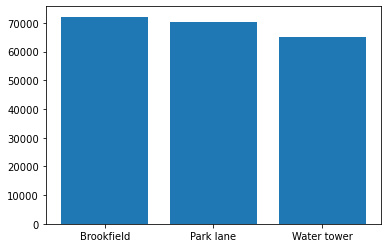
    


```python
# PIE CHART REPRESENTATION

plt.pie(sales_group)
```


    ([<matplotlib.patches.Wedge at 0x1eade0c0130>,
      <matplotlib.patches.Wedge at 0x1eade0c04f0>,
      <matplotlib.patches.Wedge at 0x1eade0c09d0>],
     [Text(0.5080357843151302, 0.9756534435214743, ''),
      Text(-1.0939745592878725, -0.11497679605427102, ''),
      Text(0.6072323961649048, -0.917207074246502, '')])


    

    


```python
# PIE CHART WITH PERCENTAGE

plt.pie(sales_group, labels=location, autopct='%1.1f%%')
```


    ([<matplotlib.patches.Wedge at 0x1eade103640>,
      <matplotlib.patches.Wedge at 0x1eade103c40>,
      <matplotlib.patches.Wedge at 0x1eade1103a0>],
     [Text(0.5080357843151302, 0.9756534435214743, 'Brookfield'),
      Text(-1.0939745592878725, -0.11497679605427102, 'Park lane'),
      Text(0.6072323961649048, -0.917207074246502, 'Water tower')],
     [Text(0.2771104278082528, 0.5321746055571678, '34.7%'),
      Text(-0.596713395975203, -0.06271461602960236, '33.9%'),
      Text(0.33121767063540253, -0.5002947677708193, '31.4%')])


    
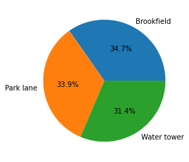
    


```python
# Q.3) which location has more female customers and which location has more male customers

```


```python
# STEP 1:
location_sales = sales.groupby(['Location', 'Gender']).count()['Invoice ID']
print('total sales count - group by Location & Gender: \n\n', location_sales)
```

    total sales count - group by Location & Gender: 
    
     Location     Gender
    Brookfield   Female    179
                 Male      161
    Park lane    Female    179
                 Male      153
    Water tower  Female    143
                 Male      185
    Name: Invoice ID, dtype: int64
    


```python
# STEP 2:
unstacked_sales = location_sales.unstack(level=0)
print('unstacked sales : \n\n', unstacked_sales)
```

    unstacked sales : 
    
     Location  Brookfield  Park lane  Water tower
    Gender                                      
    Female           179        179          143
    Male             161        153          185
    


```python
# STEP 3:
# Unstacked location list with plot()
unstacked_sales.plot()
```


    <AxesSubplot:xlabel='Gender'>


    
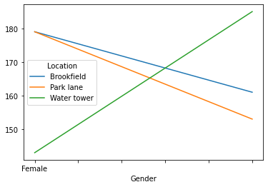
    


```python
# bar       x - label : GENDER
unstacked_sales.plot(kind='bar')
```


    <AxesSubplot:xlabel='Gender'>


    
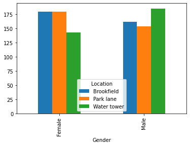
    


```python
# bar : x - label : LOCATION
location_sales_1 = sales.groupby(['Gender', 'Location']).count()['Invoice ID']
unstacked_sales_1 = location_sales_1.unstack(level=0)
unstacked_sales_1.plot(kind='bar')
```


    <AxesSubplot:xlabel='Location'>


    
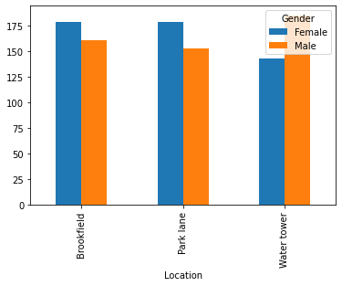
    


```python
# Q.4) what days of the month make most sales

```


```python
# EXTRACT DATE

# Default
sales['Date']

# Date yyyy-mm-dd
pd.to_datetime(sales['Date'])

# Date dd
pd.to_datetime(sales['Date']).dt.day

# Date mm
pd.to_datetime(sales['Date']).dt.month

# Date yyyy
pd.to_datetime(sales['Date']).dt.year
```


    0      2018
    1      2018
    2      2018
    3      2018
    4      2018
           ... 
    995    2018
    996    2018
    997    2018
    998    2018
    999    2018
    Name: Date, Length: 1000, dtype: int64


```python
sales.head(1)


# 
sales['Day'] = pd.to_datetime(sales['Date']).dt.day
sales.head(10)
```


<div>
<style scoped>
    .dataframe tbody tr th:only-of-type {
        vertical-align: middle;
    }

    .dataframe tbody tr th {
        vertical-align: top;
    }

    .dataframe thead th {
        text-align: right;
    }
</style>
<table border="1" class="dataframe">
  <thead>
    <tr style="text-align: right;">
      <th></th>
      <th>Invoice ID</th>
      <th>Date</th>
      <th>Time</th>
      <th>Gender</th>
      <th>Location</th>
      <th>City</th>
      <th>Member</th>
      <th>Category</th>
      <th>Price</th>
      <th>Quantity</th>
      <th>Total</th>
      <th>Payment</th>
      <th>Rating</th>
      <th>Day</th>
    </tr>
  </thead>
  <tbody>
    <tr>
      <th>0</th>
      <td>460489604</td>
      <td>1/25/2018</td>
      <td>16:46</td>
      <td>Male</td>
      <td>Brookfield</td>
      <td>NewYork</td>
      <td>Yes</td>
      <td>Groceries</td>
      <td>30</td>
      <td>1</td>
      <td>30</td>
      <td>Cash</td>
      <td>2</td>
      <td>25</td>
    </tr>
    <tr>
      <th>1</th>
      <td>471006167</td>
      <td>3/19/2018</td>
      <td>16:48</td>
      <td>Female</td>
      <td>Water tower</td>
      <td>Chicago</td>
      <td>Yes</td>
      <td>Fashion</td>
      <td>35</td>
      <td>5</td>
      <td>175</td>
      <td>Card</td>
      <td>3</td>
      <td>19</td>
    </tr>
    <tr>
      <th>2</th>
      <td>411909258</td>
      <td>2/25/2018</td>
      <td>13:33</td>
      <td>Male</td>
      <td>Water tower</td>
      <td>Chicago</td>
      <td>No</td>
      <td>Clothing</td>
      <td>57</td>
      <td>2</td>
      <td>114</td>
      <td>Cash</td>
      <td>5</td>
      <td>25</td>
    </tr>
    <tr>
      <th>3</th>
      <td>487313402</td>
      <td>1/22/2018</td>
      <td>13:38</td>
      <td>Female</td>
      <td>Park lane</td>
      <td>Dallas</td>
      <td>Yes</td>
      <td>Sporting</td>
      <td>89</td>
      <td>4</td>
      <td>356</td>
      <td>Gpay</td>
      <td>1</td>
      <td>22</td>
    </tr>
    <tr>
      <th>4</th>
      <td>197763430</td>
      <td>2/18/2018</td>
      <td>15:31</td>
      <td>Female</td>
      <td>Park lane</td>
      <td>Dallas</td>
      <td>No</td>
      <td>Books</td>
      <td>82</td>
      <td>5</td>
      <td>410</td>
      <td>Cash</td>
      <td>4</td>
      <td>18</td>
    </tr>
    <tr>
      <th>5</th>
      <td>263634050</td>
      <td>3/9/2018</td>
      <td>17:55</td>
      <td>Male</td>
      <td>Brookfield</td>
      <td>NewYork</td>
      <td>Yes</td>
      <td>Clothing</td>
      <td>52</td>
      <td>4</td>
      <td>208</td>
      <td>Gpay</td>
      <td>3</td>
      <td>9</td>
    </tr>
    <tr>
      <th>6</th>
      <td>99646662</td>
      <td>3/4/2018</td>
      <td>13:21</td>
      <td>Male</td>
      <td>Water tower</td>
      <td>Chicago</td>
      <td>No</td>
      <td>Clothing</td>
      <td>81</td>
      <td>3</td>
      <td>243</td>
      <td>Cash</td>
      <td>4</td>
      <td>4</td>
    </tr>
    <tr>
      <th>7</th>
      <td>188869875</td>
      <td>3/8/2018</td>
      <td>13:24</td>
      <td>Male</td>
      <td>Park lane</td>
      <td>Dallas</td>
      <td>No</td>
      <td>Books</td>
      <td>80</td>
      <td>2</td>
      <td>160</td>
      <td>Cash</td>
      <td>3</td>
      <td>8</td>
    </tr>
    <tr>
      <th>8</th>
      <td>325637547</td>
      <td>1/18/2018</td>
      <td>15:33</td>
      <td>Male</td>
      <td>Park lane</td>
      <td>Dallas</td>
      <td>Yes</td>
      <td>Clothing</td>
      <td>91</td>
      <td>3</td>
      <td>273</td>
      <td>Card</td>
      <td>3</td>
      <td>18</td>
    </tr>
    <tr>
      <th>9</th>
      <td>562942936</td>
      <td>2/24/2018</td>
      <td>16:05</td>
      <td>Female</td>
      <td>Park lane</td>
      <td>Dallas</td>
      <td>No</td>
      <td>Books</td>
      <td>80</td>
      <td>2</td>
      <td>160</td>
      <td>Cash</td>
      <td>4</td>
      <td>24</td>
    </tr>
  </tbody>
</table>
</div>


```python

day_sales = sales.groupby('Day').sum()['Total']
print(day_sales)
```

    Day
    1     6301
    2     8247
    3     8533
    4     6593
    5     9177
    6     5976
    7     6164
    8     8313
    9     9142
    10    6444
    11    4755
    12    7714
    13    5688
    14    7978
    15    9677
    16    5912
    17    5833
    18    4625
    19    7481
    20    7333
    21    4300
    22    5788
    23    6949
    24    7819
    25    8638
    26    7165
    27    8154
    28    6467
    29    4662
    30    3530
    31    2430
    Name: Total, dtype: int64
    


```python
day_sales.plot()
```


    <AxesSubplot:xlabel='Day'>


    
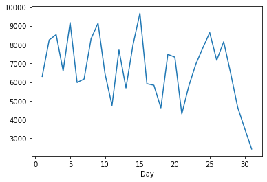
    


```python
# Q.5) Which branch has more members and which branch has less members
```


```python
sales.head(10)
```


<div>
<style scoped>
    .dataframe tbody tr th:only-of-type {
        vertical-align: middle;
    }

    .dataframe tbody tr th {
        vertical-align: top;
    }

    .dataframe thead th {
        text-align: right;
    }
</style>
<table border="1" class="dataframe">
  <thead>
    <tr style="text-align: right;">
      <th></th>
      <th>Invoice ID</th>
      <th>Date</th>
      <th>Time</th>
      <th>Gender</th>
      <th>Location</th>
      <th>City</th>
      <th>Member</th>
      <th>Category</th>
      <th>Price</th>
      <th>Quantity</th>
      <th>Total</th>
      <th>Payment</th>
      <th>Rating</th>
      <th>Day</th>
    </tr>
  </thead>
  <tbody>
    <tr>
      <th>0</th>
      <td>460489604</td>
      <td>1/25/2018</td>
      <td>16:46</td>
      <td>Male</td>
      <td>Brookfield</td>
      <td>NewYork</td>
      <td>Yes</td>
      <td>Groceries</td>
      <td>30</td>
      <td>1</td>
      <td>30</td>
      <td>Cash</td>
      <td>2</td>
      <td>25</td>
    </tr>
    <tr>
      <th>1</th>
      <td>471006167</td>
      <td>3/19/2018</td>
      <td>16:48</td>
      <td>Female</td>
      <td>Water tower</td>
      <td>Chicago</td>
      <td>Yes</td>
      <td>Fashion</td>
      <td>35</td>
      <td>5</td>
      <td>175</td>
      <td>Card</td>
      <td>3</td>
      <td>19</td>
    </tr>
    <tr>
      <th>2</th>
      <td>411909258</td>
      <td>2/25/2018</td>
      <td>13:33</td>
      <td>Male</td>
      <td>Water tower</td>
      <td>Chicago</td>
      <td>No</td>
      <td>Clothing</td>
      <td>57</td>
      <td>2</td>
      <td>114</td>
      <td>Cash</td>
      <td>5</td>
      <td>25</td>
    </tr>
    <tr>
      <th>3</th>
      <td>487313402</td>
      <td>1/22/2018</td>
      <td>13:38</td>
      <td>Female</td>
      <td>Park lane</td>
      <td>Dallas</td>
      <td>Yes</td>
      <td>Sporting</td>
      <td>89</td>
      <td>4</td>
      <td>356</td>
      <td>Gpay</td>
      <td>1</td>
      <td>22</td>
    </tr>
    <tr>
      <th>4</th>
      <td>197763430</td>
      <td>2/18/2018</td>
      <td>15:31</td>
      <td>Female</td>
      <td>Park lane</td>
      <td>Dallas</td>
      <td>No</td>
      <td>Books</td>
      <td>82</td>
      <td>5</td>
      <td>410</td>
      <td>Cash</td>
      <td>4</td>
      <td>18</td>
    </tr>
    <tr>
      <th>5</th>
      <td>263634050</td>
      <td>3/9/2018</td>
      <td>17:55</td>
      <td>Male</td>
      <td>Brookfield</td>
      <td>NewYork</td>
      <td>Yes</td>
      <td>Clothing</td>
      <td>52</td>
      <td>4</td>
      <td>208</td>
      <td>Gpay</td>
      <td>3</td>
      <td>9</td>
    </tr>
    <tr>
      <th>6</th>
      <td>99646662</td>
      <td>3/4/2018</td>
      <td>13:21</td>
      <td>Male</td>
      <td>Water tower</td>
      <td>Chicago</td>
      <td>No</td>
      <td>Clothing</td>
      <td>81</td>
      <td>3</td>
      <td>243</td>
      <td>Cash</td>
      <td>4</td>
      <td>4</td>
    </tr>
    <tr>
      <th>7</th>
      <td>188869875</td>
      <td>3/8/2018</td>
      <td>13:24</td>
      <td>Male</td>
      <td>Park lane</td>
      <td>Dallas</td>
      <td>No</td>
      <td>Books</td>
      <td>80</td>
      <td>2</td>
      <td>160</td>
      <td>Cash</td>
      <td>3</td>
      <td>8</td>
    </tr>
    <tr>
      <th>8</th>
      <td>325637547</td>
      <td>1/18/2018</td>
      <td>15:33</td>
      <td>Male</td>
      <td>Park lane</td>
      <td>Dallas</td>
      <td>Yes</td>
      <td>Clothing</td>
      <td>91</td>
      <td>3</td>
      <td>273</td>
      <td>Card</td>
      <td>3</td>
      <td>18</td>
    </tr>
    <tr>
      <th>9</th>
      <td>562942936</td>
      <td>2/24/2018</td>
      <td>16:05</td>
      <td>Female</td>
      <td>Park lane</td>
      <td>Dallas</td>
      <td>No</td>
      <td>Books</td>
      <td>80</td>
      <td>2</td>
      <td>160</td>
      <td>Cash</td>
      <td>4</td>
      <td>24</td>
    </tr>
  </tbody>
</table>
</div>


```python
members = sales.groupby(['Member', 'Location']).count()['Invoice ID']
members
```


    Member  Location   
    No      Brookfield     173
            Park lane      167
            Water tower    159
    Yes     Brookfield     167
            Park lane      165
            Water tower    169
    Name: Invoice ID, dtype: int64


```python
members.unstack(level=0)
```


<div>
<style scoped>
    .dataframe tbody tr th:only-of-type {
        vertical-align: middle;
    }

    .dataframe tbody tr th {
        vertical-align: top;
    }

    .dataframe thead th {
        text-align: right;
    }
</style>
<table border="1" class="dataframe">
  <thead>
    <tr style="text-align: right;">
      <th>Member</th>
      <th>No</th>
      <th>Yes</th>
    </tr>
    <tr>
      <th>Location</th>
      <th></th>
      <th></th>
    </tr>
  </thead>
  <tbody>
    <tr>
      <th>Brookfield</th>
      <td>173</td>
      <td>167</td>
    </tr>
    <tr>
      <th>Park lane</th>
      <td>167</td>
      <td>165</td>
    </tr>
    <tr>
      <th>Water tower</th>
      <td>159</td>
      <td>169</td>
    </tr>
  </tbody>
</table>
</div>


```python
members.unstack(level=0).plot(kind='bar')
```


    <AxesSubplot:xlabel='Location'>


    
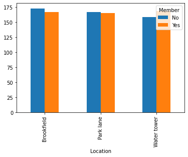
    


```python
# Q.6) Which branch has highest rating and which branch has lowest

```


```python
rating = sales.groupby(['Location']).mean()['Rating']
rating
```


    Location
    Brookfield     2.782353
    Park lane      3.021084
    Water tower    3.118902
    Name: Rating, dtype: float64


```python
rating.plot(kind='bar')
```


    <AxesSubplot:xlabel='Location'>


    

    


```python
# Q.7) Which city has more female shopping

```


```python
female_shoppers = sales.groupby(['City', 'Gender']).count()['Invoice ID']
female_shoppers
```


    City     Gender
    Chicago  Female    143
             Male      185
    Dallas   Female    179
             Male      153
    NewYork  Female    179
             Male      161
    Name: Invoice ID, dtype: int64


```python
unstack_female_shoppers = female_shoppers.unstack(level=0)
unstack_female_shoppers
```


<div>
<style scoped>
    .dataframe tbody tr th:only-of-type {
        vertical-align: middle;
    }

    .dataframe tbody tr th {
        vertical-align: top;
    }

    .dataframe thead th {
        text-align: right;
    }
</style>
<table border="1" class="dataframe">
  <thead>
    <tr style="text-align: right;">
      <th>City</th>
      <th>Chicago</th>
      <th>Dallas</th>
      <th>NewYork</th>
    </tr>
    <tr>
      <th>Gender</th>
      <th></th>
      <th></th>
      <th></th>
    </tr>
  </thead>
  <tbody>
    <tr>
      <th>Female</th>
      <td>143</td>
      <td>179</td>
      <td>179</td>
    </tr>
    <tr>
      <th>Male</th>
      <td>185</td>
      <td>153</td>
      <td>161</td>
    </tr>
  </tbody>
</table>
</div>


```python
# Categorized by gender
unstack_female_shoppers.plot(kind='bar')
```


    <AxesSubplot:xlabel='Gender'>


    
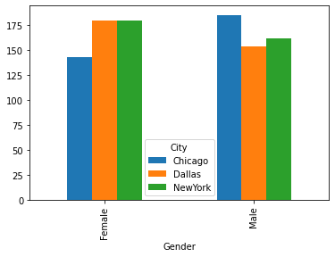
    


```python
# categorized by city
female_shoppers_1 = sales.groupby(['Gender', 'City']).count()['Invoice ID']
print(female_shoppers_1.unstack(level=0))

female_shoppers_1.unstack(level=0).plot(kind='bar')
```

    Gender   Female  Male
    City                 
    Chicago     143   185
    Dallas      179   153
    NewYork     179   161
    


    <AxesSubplot:xlabel='City'>


    
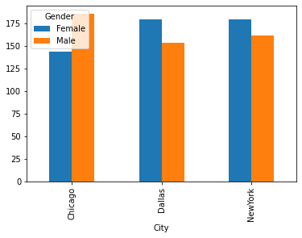
    


```python
# Q.8) Who spends more men / women
```


```python
spend = sales.groupby('Gender').sum()['Total']
print(spend)

spend.plot(kind='bar')
```

    Gender
    Female    106452
    Male      101336
    Name: Total, dtype: int64
    


    <AxesSubplot:xlabel='Gender'>


    
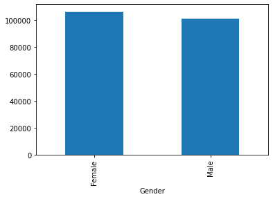
    


```python
# Q.9) Which type of customer spends more memeber or non-member
```


```python
member_spends = sales.groupby('Member').sum()['Total']
print(member_spends)

member_spends.plot(kind='bar')
```

    Member
    No     100245
    Yes    107543
    Name: Total, dtype: int64
    


    <AxesSubplot:xlabel='Member'>


    
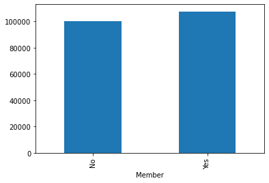
    


```python
# Q.10) Which product line sells more
```


```python
most_sell = sales.groupby('Category').count()['Invoice ID']
print(most_sell)

most_sell.plot(kind='bar')
```

    Category
    Books        165
    Clothing     170
    Fashion      153
    Furniture    160
    Groceries    174
    Sporting     178
    Name: Invoice ID, dtype: int64
    


    <AxesSubplot:xlabel='Category'>


    
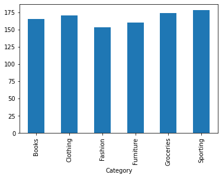
    


```python
# Q.11) Which product line is popular among men vs women
```


```python
most_sell_gender = sales.groupby(['Gender', 'Category']).count()['Invoice ID']
print(most_sell_gender)

unstack_most_sell_gender = most_sell_gender.unstack(level=0)
print('\n\n', unstack_most_sell_gender)

unstack_most_sell_gender.plot(kind='bar')
```

    Gender  Category 
    Female  Books        88
            Clothing     81
            Fashion      81
            Furniture    78
            Groceries    87
            Sporting     86
    Male    Books        77
            Clothing     89
            Fashion      72
            Furniture    82
            Groceries    87
            Sporting     92
    Name: Invoice ID, dtype: int64
    
    
     Gender     Female  Male
    Category               
    Books          88    77
    Clothing       81    89
    Fashion        81    72
    Furniture      78    82
    Groceries      87    87
    Sporting       86    92
    


    <AxesSubplot:xlabel='Category'>


    
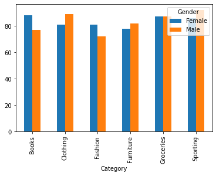
    


```python
# Q.12) Which month may makes more sales
```


```python
sales.head(1)
```


<div>
<style scoped>
    .dataframe tbody tr th:only-of-type {
        vertical-align: middle;
    }

    .dataframe tbody tr th {
        vertical-align: top;
    }

    .dataframe thead th {
        text-align: right;
    }
</style>
<table border="1" class="dataframe">
  <thead>
    <tr style="text-align: right;">
      <th></th>
      <th>Invoice ID</th>
      <th>Date</th>
      <th>Time</th>
      <th>Gender</th>
      <th>Location</th>
      <th>City</th>
      <th>Member</th>
      <th>Category</th>
      <th>Price</th>
      <th>Quantity</th>
      <th>Total</th>
      <th>Payment</th>
      <th>Rating</th>
      <th>Day</th>
    </tr>
  </thead>
  <tbody>
    <tr>
      <th>0</th>
      <td>460489604</td>
      <td>1/25/2018</td>
      <td>16:46</td>
      <td>Male</td>
      <td>Brookfield</td>
      <td>NewYork</td>
      <td>Yes</td>
      <td>Groceries</td>
      <td>30</td>
      <td>1</td>
      <td>30</td>
      <td>Cash</td>
      <td>2</td>
      <td>25</td>
    </tr>
  </tbody>
</table>
</div>


```python
sales['Month'] = pd.to_datetime(sales['Date']).dt.month
sales.head(10)
```


<div>
<style scoped>
    .dataframe tbody tr th:only-of-type {
        vertical-align: middle;
    }

    .dataframe tbody tr th {
        vertical-align: top;
    }

    .dataframe thead th {
        text-align: right;
    }
</style>
<table border="1" class="dataframe">
  <thead>
    <tr style="text-align: right;">
      <th></th>
      <th>Invoice ID</th>
      <th>Date</th>
      <th>Time</th>
      <th>Gender</th>
      <th>Location</th>
      <th>City</th>
      <th>Member</th>
      <th>Category</th>
      <th>Price</th>
      <th>Quantity</th>
      <th>Total</th>
      <th>Payment</th>
      <th>Rating</th>
      <th>Day</th>
      <th>Month</th>
    </tr>
  </thead>
  <tbody>
    <tr>
      <th>0</th>
      <td>460489604</td>
      <td>1/25/2018</td>
      <td>16:46</td>
      <td>Male</td>
      <td>Brookfield</td>
      <td>NewYork</td>
      <td>Yes</td>
      <td>Groceries</td>
      <td>30</td>
      <td>1</td>
      <td>30</td>
      <td>Cash</td>
      <td>2</td>
      <td>25</td>
      <td>1</td>
    </tr>
    <tr>
      <th>1</th>
      <td>471006167</td>
      <td>3/19/2018</td>
      <td>16:48</td>
      <td>Female</td>
      <td>Water tower</td>
      <td>Chicago</td>
      <td>Yes</td>
      <td>Fashion</td>
      <td>35</td>
      <td>5</td>
      <td>175</td>
      <td>Card</td>
      <td>3</td>
      <td>19</td>
      <td>3</td>
    </tr>
    <tr>
      <th>2</th>
      <td>411909258</td>
      <td>2/25/2018</td>
      <td>13:33</td>
      <td>Male</td>
      <td>Water tower</td>
      <td>Chicago</td>
      <td>No</td>
      <td>Clothing</td>
      <td>57</td>
      <td>2</td>
      <td>114</td>
      <td>Cash</td>
      <td>5</td>
      <td>25</td>
      <td>2</td>
    </tr>
    <tr>
      <th>3</th>
      <td>487313402</td>
      <td>1/22/2018</td>
      <td>13:38</td>
      <td>Female</td>
      <td>Park lane</td>
      <td>Dallas</td>
      <td>Yes</td>
      <td>Sporting</td>
      <td>89</td>
      <td>4</td>
      <td>356</td>
      <td>Gpay</td>
      <td>1</td>
      <td>22</td>
      <td>1</td>
    </tr>
    <tr>
      <th>4</th>
      <td>197763430</td>
      <td>2/18/2018</td>
      <td>15:31</td>
      <td>Female</td>
      <td>Park lane</td>
      <td>Dallas</td>
      <td>No</td>
      <td>Books</td>
      <td>82</td>
      <td>5</td>
      <td>410</td>
      <td>Cash</td>
      <td>4</td>
      <td>18</td>
      <td>2</td>
    </tr>
    <tr>
      <th>5</th>
      <td>263634050</td>
      <td>3/9/2018</td>
      <td>17:55</td>
      <td>Male</td>
      <td>Brookfield</td>
      <td>NewYork</td>
      <td>Yes</td>
      <td>Clothing</td>
      <td>52</td>
      <td>4</td>
      <td>208</td>
      <td>Gpay</td>
      <td>3</td>
      <td>9</td>
      <td>3</td>
    </tr>
    <tr>
      <th>6</th>
      <td>99646662</td>
      <td>3/4/2018</td>
      <td>13:21</td>
      <td>Male</td>
      <td>Water tower</td>
      <td>Chicago</td>
      <td>No</td>
      <td>Clothing</td>
      <td>81</td>
      <td>3</td>
      <td>243</td>
      <td>Cash</td>
      <td>4</td>
      <td>4</td>
      <td>3</td>
    </tr>
    <tr>
      <th>7</th>
      <td>188869875</td>
      <td>3/8/2018</td>
      <td>13:24</td>
      <td>Male</td>
      <td>Park lane</td>
      <td>Dallas</td>
      <td>No</td>
      <td>Books</td>
      <td>80</td>
      <td>2</td>
      <td>160</td>
      <td>Cash</td>
      <td>3</td>
      <td>8</td>
      <td>3</td>
    </tr>
    <tr>
      <th>8</th>
      <td>325637547</td>
      <td>1/18/2018</td>
      <td>15:33</td>
      <td>Male</td>
      <td>Park lane</td>
      <td>Dallas</td>
      <td>Yes</td>
      <td>Clothing</td>
      <td>91</td>
      <td>3</td>
      <td>273</td>
      <td>Card</td>
      <td>3</td>
      <td>18</td>
      <td>1</td>
    </tr>
    <tr>
      <th>9</th>
      <td>562942936</td>
      <td>2/24/2018</td>
      <td>16:05</td>
      <td>Female</td>
      <td>Park lane</td>
      <td>Dallas</td>
      <td>No</td>
      <td>Books</td>
      <td>80</td>
      <td>2</td>
      <td>160</td>
      <td>Cash</td>
      <td>4</td>
      <td>24</td>
      <td>2</td>
    </tr>
  </tbody>
</table>
</div>


```python
month_sales = sales.groupby('Month').sum()['Total']
month_sales
```


    Month
    1    71652
    2    63850
    3    72286
    Name: Total, dtype: int64


```python
month_sales.plot(kind='bar')
```


    <AxesSubplot:xlabel='Month'>


    
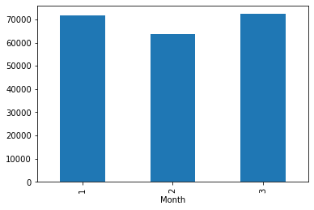
    


```python
plt.grid(month_sales.plot(kind='bar'))
```


    
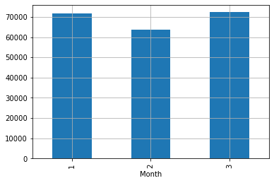
    


```python

```


